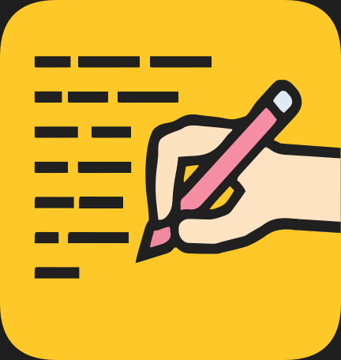

# NoteNext

<p align="center">
  
</p>

<p align="center">
  <strong>The premium note-taking experience for Android.</strong>
</p>

<p align="center">
  
  
  
  
</p>

---

## Introduction

NoteNext is a high-performance, private, and visually sophisticated note-taking application designed for the modern Android ecosystem. It prioritizes a fluid user experience through cutting-edge design principles and robust local-first architecture.

## Advanced Design: Material 3 Expressive

NoteNext is built using the latest **Material 3 Expressive (M3E)** design system. This represents a significant evolution in user interface aesthetics and interaction:

- **Expressive Motion**: Every interaction is powered by spring-based physics, providing a tactile and responsive feel that adapts to user intent.
- **Dynamic Shapes**: Utilizing adaptive corner rounding and morphing shapes to create a modern, organic interface.
- **Vibrant Typography**: Featuring Roboto Flex for superior legibility and a sophisticated typographic hierarchy.
* **Fluid UI Components**: High-contrast buttons, card layouts, and navigation elements designed for clarity and ease of use.

## Key Features

- **Rich Content Creation**: Craft detailed notes with advanced formatting options, including bold, italic, and structured headings.
- **Interactive Checklists**: Efficiently manage tasks and to-do lists with seamless state tracking and organization.
- **Workspace Management**: Group related thoughts and documentation into dedicated Projects for better organization.
- **Privacy First**: Secure your sensitive information with industry-standard biometric authentication, including fingerprint and face unlock.
- **Cloud & Local Backup**: Keep your data safe with integrated Google Drive synchronization or encrypted local storage exports.
- **Intelligent Organization**: Utilize custom labels, color-coding, and powerful search capabilities to find information instantly.
- **Smart Reminders**: Set time-based alerts to ensure important tasks and notes are never overlooked.
- **Rich Media Support**: Seamlessly attach images, documents, and interactive link previews to your documentation.

## Getting Started

### Installation

1. Clone the repository:
   ```bash
   git clone https://github.com/suvojeet-sengupta/NoteNext.git
   ```
2. Open the project in Android Studio.
3. Build and deploy to your Android device.

## Contributing

We welcome contributions from the developer community. If you wish to improve NoteNext, please follow the standard GitHub workflow: fork the repository, create a feature branch, and submit a pull request for review.

## License

This project is distributed under the MIT License. Detailed information can be found in the [LICENSE](LICENSE) file.

## Contact

**Suvojeet Sengupta**  
[Email](mailto:support@suvojeetsengupta.in) | [GitHub](https://github.com/suvojeet-sengupta)

Project Repository: [https://github.com/suvojeet-sengupta/NoteNext](https://github.com/suvojeet-sengupta/NoteNext)
